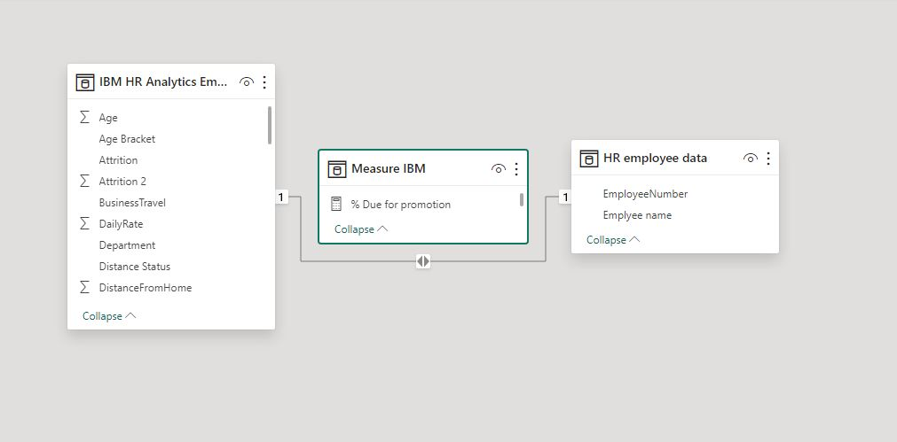
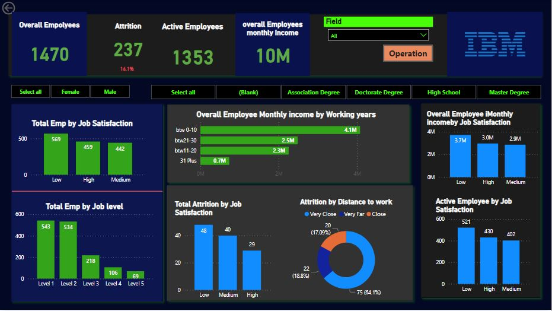
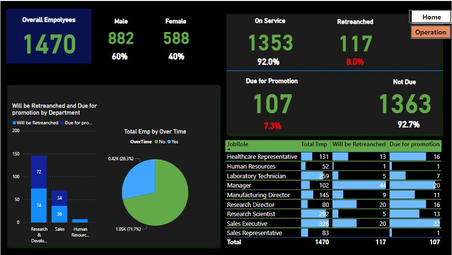
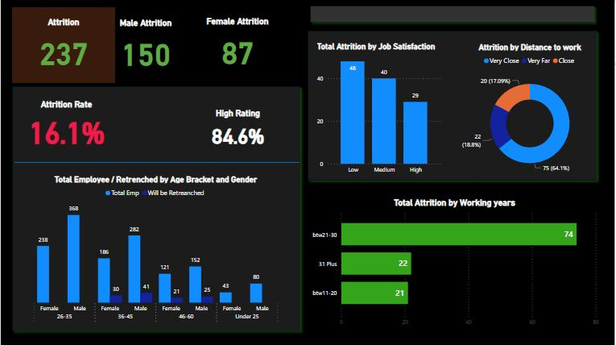
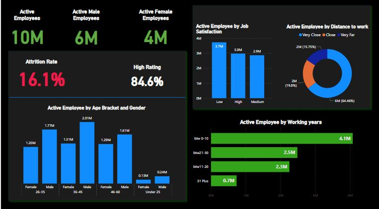

## IBM HR employee attrition & performance Analysis

My role as a data analyst involved a focused exploration of IBM's HR attrition, aiming to unveil insights within the employee turnover landscape. Leveraging data analytics, I scrutinized patterns, identified key factors influencing attrition, and offered a nuanced perspective on workforce dynamics. The project extended beyond numerical metrics, incorporating qualitative inputs from employee feedback to provide a holistic view using dashboard. Ultimately, this analysis serves as a valuable tool for IBM, guiding strategic decisions to mitigate attrition and enhance overall workforce retention.

## Introduction
I was given a data to work on and was particularly impressed by its richness and complexity. Having been eager to enhance my skills in data cleaning, analysis, and visualization, I found this dataset to be an ideal opportunity to immerse myself in a challenging and real-world application. I plan to use it as a case study, enabling me to not only refine my technical abilities but also to explore how data-driven insights can be harnessed to address genuine problems. This hands-on experience promises to be a valuable stepping stone in my journey to becoming a proficient data analyst.
Situation
My boss has just reached out to you to create a dashboard on HR Employee Attrition & Performance that only looked into the attrition, retention issue and job dissatisfaction in the organization

## Scoping meeting 
Summary from the meeting is that we are facing a big setback in the organization as a result of Economic Recession the board suggest, the way out of this recession crisis is to lay off staff from the organization to reducing cost and as a Data and business analyst in of the company, I was asking to come up with an idea to Protect the company Employer brand.
 
## Situation
The dataset might need a bit cleaning, push it into power query and having it cleaning and transformed, make use of SQL to answer some logical question been ask by the board of director in the organization

## Power BI Concepts applied:
- Data Cleaning: Remove Top row, Check for 100% Accuracy
- DAX Concepts: Calculated column, Custom Column, divide, IF.
- Data Modelling:

## Data Transformation/Cleaning:
Data was efficiently cleaned and transformed with the Power Query Editor of Power BI. Some of the applied steps included
Making first row as headers in the IBM HR and Employee data tables.
Analytical transformation of the 'IBM HR table'; Categorizing the employees’ distances from home into (Very far, Close and Very-Close)

## Dax formular used
- Total Emp = COUNTROWS('IBM HR Analytics Employee Attri')
- Male = CALCULATE([Total Emp],'IBM HR Analytics Employee Attri'[Gender]="Male")
- Female = CALCULATE([Total Emp],'IBM HR Analytics Employee Attri'[Gender]="Female")
- % Male = DIVIDE([Male],[Total Emp],0)
- % Female = DIVIDE([Female],[Total Emp],0)
- Attrition Rate = SUM('IBM HR Analytics Employee Attri'[Attrition 2])/[Total Emp]
- Due for promotion = IF(ISBLANK(CALCULATE([Total Emp],'IBM HR Analytics Employee Attri'[Promotion Status]="Due for promotion")),0,CALCULATE([Total Emp],'IBM HR Analytics Employee
- Attri'[Promotion Status]="Due for promotion"))
- On Service = CALCULATE([Total Emp],'IBM HR Analytics Employee Attri'[Retrenchment Status]="On Services")
- Will be Retreanched = CALCULATE([Total Emp],'IBM HR Analytics Employee Attri'[Retrenchment Status]="Will be Retreanched")
- % Not due = DIVIDE([Not Due],[Total Emp],0)
- High Rating = CALCULATE([Total Emp],'IBM HR Analytics Employee Attri'[Performance Rating]="High Rating")
- Low Rating = CALCULATE([Total Emp],'IBM HR Analytics Employee Attri'[Performance Rating]="Low Rating")
- % Retreanched = DIVIDE([Will be Retreanched],[Total Emp],0)

## DATA MODELLING
Power BI automatically connected related tables resulting in a Bart schema model. The 'IBM HR' table is the fact table of the model. The remaining two-dimension tables; 'HR employee data' table and 'Measure IBM' table are connected to the ' IBM HR' ' table via the common columns: 'Employee Number' and respectively.

## Insight needed in the dashboard

1.	Categorize the employees’ distances from home into (Very far, Close and Very-Close)
2.	Break the employees’ work years into groups with interval of 10 years
3.	Transform the job satisfaction from number (1,2,3,4) to something more readable
4.	Create an age -bucket for the Employees age column
5.	Show necessary KPI in your dashboard

To have an idea of how long it takes for the attrition to arrive and also those that are on service and to know their level of satisfaction. To calculate this, I will be making use of the conditional function Using "custom columns", Attrition Rate = SUM('IBM HR Analytics Employee Attri'[Attrition 2])/[Total Emp]
To break the employee working year into group will make use of a Dax function to categories all the age by given it 10 years interval = Table.RenameColumns(#"Added Conditional Column8",{{"Custom", "Total Working Year"}})

To transform job satisfaction into a meaning pattern by removing (1,2,3,4) by converting it into level (High level, low level, medium level) using this Dax Function = Table.AddColumn(#"Expanded HR employee data", "Job Satisfaction", each if [JobSatisfaction] <= 2 then "Low" else if [JobSatisfaction] = 3 then "Medium" else "High")
Create an age -bucket for the Employees age column using Dax function   = Table.AddColumn(#"Added Conditional Column7", "Custom", each if [TotalWorkingYears] <= 10 then "btw 0-10" else if [TotalWorkingYears] <= 20 then "btw11-20" else if [TotalWorkingYears] <= 30 then "btw21-30" else "31 Plus")

## Data Analysis and Visuals

 
 
1.	From the dashboard, it is observed that the Overall Employee =1470 which means with the addition of attrition.
2.	Attrition = 237 when the company is above 10% attrition rate it means the company brand repetition is at stack as you can see the AT=16.1% 

3.	Total Monthly income for Employee =10m, overall male monthly income = 6M, overall female monthly income =4M
4.	Looking at the dashboard we can see that the Age group between 36-45 years the company is really invested in the employee.

 
    
 
7.	Attrition is increasing as a result of the Economic Crisis Total Attrition = 237 Male=150, Female= 87
 

6.	Base on my analysis 
Active Employee = 1353, 
Active Male Employee = 816 
Active Female Employee = 537

## conclusions & Recommendations

- Job satisfaction have a major impact on attrition which might result in the Company Employee Brand which can be reduce by focusing on the enabling innovate, Productivity mindset and encourage experimentation
- The company can come out of the crisis by focusing on retention which equal satisfaction the organization is not a recession proof which mean we need to focus our retention to keep the company running.
- Layoff is not the only way to cut labor cost the company can consider hourly reductions, furloughs, and Performance Pay.
- Unpaid or Partially compensation leaves depending on the local labor can also be a great way to cut labor cost

